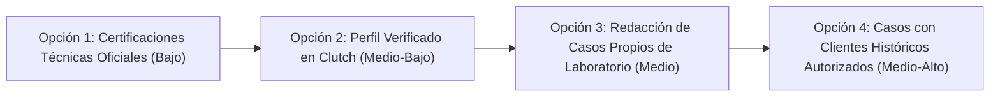

# 🏆 Investigación — Cómo construir prueba social desde cero (TASK-003)

> **Documento:** `docs/investigacion/prueba-social.md` · **Tarea:** [TASK-003](../comms/TASK-003-investigacion-prueba-social.md)
> **Autora:** Ania (DEV principal) · **Fecha:** 2026-09-26
> **Muestra base:** 20 agencias internacionales de [TASK-001](../comms/TASK-001-investigacion-benchmark-agencias.md) y archivos locales de `pharmaco.pe`.
> **Estado:** Documento completo con evidencia cuantitativa, análisis estructural, requisitos oficiales de acreditación e inventario de activos locales.

---

## Parte 1. Qué usan las agencias de la muestra (Benchmark de 20 agencias)

Pharmaco se retoma sin prueba social validada ([`DECISION-002`](../comms/DECISION-002-catalogo-base-servicios.md)). Para entender qué elementos convencen a un cliente en 2026, se analizó el uso de prueba social en la muestra verificada en vivo de 20 agencias (10 Europa, 10 América), desglosando entre **Comparables** (10 agencias independientes de 10 a 80 empleados) y **Referentes / Especialistas** (10 agencias de gran escala o de nicho tecnológico).

### 1.1 Frecuencia por tipo de prueba social

| Tipo de Prueba Social | Total (de 20) | Comparables (de 10) | Referentes / Especialistas (de 10) | Frecuencia Relativa | Observación de Uso |
| :--- | :--- | :--- | :--- | :--- | :--- |
| **Logos de clientes conocidos** | **20** | 10 | 10 | 100% | Elemento universal sin excepciones. Se ubica inmediatamente tras el Hero principal o en la mitad de la home. |
| **Casos de estudio detallados** | **20** | 10 | 10 | 100% | Fichas individuales con narrativa de proyecto. En referentes el caso es altamente visual; en comparables incluye procesos y tecnologías. |
| **Testimonios de clientes con nombre/cargo** | **18** | 9 | 9 | 90% | Citas directas con fotografía real, nombre y cargo directivo. Los referentes usan citas breves integradas; los comparables, módulos destacados. |
| **Premios del sector (Awwwards, Cannes, Webby, Clutch)** | **19** | 9 | 10 | 95% | Predominante en agencias de diseño y creatividad (Dogstudio, Monopo, Bravoure, Instrument) y en rankings B2B (Clutch en comparables). |
| **Certificaciones y partnerships oficiales** | **19** | 9 | 10 | 95% | Sellos de Google Premier Partner, Meta Business Partner, HubSpot, AWS, Databricks, Shopify Plus. Crítico en agencias medianas y técnicas. |
| **Casos con métricas cuantitativas explícitas** | **9** | 7 | 2 | 45% | Cifras porcentuales de crecimiento (+X%), ROAS, aumento de tráfico o reducción de CPA. Muy concentrado en agencias de performance y CRO (Upraw, Brolik, Atomic, Major Tom). |
| **Contenido experto propio (Blog, Podcast, Libros)** | **7** | 4 | 3 | 35% | Artículos técnicos de fondo, informes anuales descargables, podcasts sectoriales (Upraw, Single Grain) o libros corporativos (Good Rebels). |
| **Reseñas en plataformas de terceros (Clutch, Google)** | **7** | 6 | 1 | 35% | **Diferencia clave:** Muy usado por agencias comparables medianas (Atomic, Lounge Lizard, Brolik, Single Grain); los gigantes globales (Media.Monks, Work & Co) no usan Clutch. |
| **Cifras agregadas de impacto («Impact Stats»)** | **8** | 5 | 3 | 40% | Números acumulados en la home: «+20 años», «+$50M generados», «2.000+ personas», «50% engineers, 50% creatives». |

---

## Parte 2. Anatomía de un caso de éxito (Case Study)

A partir del análisis de las páginas de caso de la muestra navegadas en vivo, se determinó el estándar de arquitectura de información que estructura un caso convincente:

### 2.1 Estructura canónica (en orden de lectura)

```text
1. Cabecera (Hero del caso)
   ├── Nombre del cliente + Categoría / Servicios prestados (tags)
   ├── Titular de impacto (el resultado o concepto en una frase)
   └── Imagen o video principal (Mockup editorial o showreel)
2. El Reto (The Challenge / El Problema)
   ├── Contexto del cliente y situación inicial
   └── Qué impedía su crecimiento o qué objetivo perseguía
3. La Estrategia y Solución (The Solution / Lo que hicimos)
   ├── Proceso de trabajo (Discovery, Sprint de diseño, Arquitectura técnica)
   ├── Muestras visuales en alta definición (capturas, prototipos interactivos, fotos de set)
   └── Herramientas y tecnologías aplicadas (Stack)
4. Los Resultados (The Impact / Métricas)
   ├── 2 a 4 estadísticas cuantitativas en gran tamaño (ej. «+46% Conversión», «567% Loan Volume»)
   └── Declaración del impacto cualitativo en el negocio
5. Testimonio del Cliente (Social Proof Quote)
   └── Cita textual del interlocutor + Foto + Nombre + Cargo + Empresa
6. Créditos del equipo y CTA de cierre
   └── Quién participó + Botón directo: «¿Tienes un reto similar? Hablemos»
```

### 2.2 Tres casos modelo de referencia verificados en vivo

1. **Modelo de Métricas y Conversión (B2B SaaS / CRO):**
   * **Agencia:** Upraw Media (Reino Unido)
   * **URL:** `https://www.uprawmedia.com/seon-cro-case-study`
   * **Por qué sirve de modelo:** Enfoque ultra directo al ROI. Empieza inmediatamente con la métrica central (+46% de incremento en tasa de conversión de landing pages de alta intención para SEON), desglosa la hipótesis de experimentación, el diseño de la nueva interfaz y la validación estadística.
2. **Modelo de Producción Creativa, Video y Branding:**
   * **Agencia:** Bravoure (Países Bajos)
   * **URL:** `https://bravoure.nl/en/case-studies/oxfam-novib`
   * **Por qué sirve de modelo:** Demuestra la integración de video, identidad visual y plataforma interactiva. Utiliza recursos visuales en movimiento, dirección de arte contemporánea y despiece de todos los componentes interactivos de la campaña.
3. **Modelo de Crecimiento a Largo Plazo y Multicanal (Comparable):**
   * **Agencia:** Brolik (EE. UU.)
   * **URL:** `https://brolik.com/work/full-funnel-marketing-real-estate-lender`
   * **Por qué sirve de modelo:** Estructura de relación de retainer comercial a 10 años. Detalla cómo la integración de desarrollo web, branding, video y marketing de captación permitió multiplicar por 5.67x (+567%) el volumen de negocio de un prestamista inmobiliario.

---

## Parte 3. Qué se puede construir sin historial de clientes grandes

Para una agencia en fase de reactivación que no cuenta con un histórico reciente de clientes corporativos con métricas públicas, las agencias analizadas demuestran que es posible generar credibilidad inmediata mediante **cuatro frentes accesibles sin clientes grandes**:

### 3.1 Certificaciones oficiales de plataformas líderes

Las certificaciones de partners aportan validación técnica externa garantizada por corporaciones globales:

| Certificación / Programa | Requisitos Oficiales | Coste | Tiempo de Obtención | Fuente Oficial (consultada 2026) | Agencias que lo usan |
| :--- | :--- | :--- | :--- | :--- | :--- |
| **Google Cloud / Google Analytics 4 Certification** | Aprobar los exámenes oficiales en Google Skillshop (80% aciertos). Demostrar dominio en medición, GA4 y Tag Manager. | **Gratuito** | 1 a 2 semanas por persona | [Google Skillshop](https://skillshop.docebosaas.com/) | Artefact, Neo Consulting, Upraw Media |
| **Meta Certified Media & Marketing Science** | Aprobar exámenes en Meta Blueprint (100-101 / 400-101) sobre planificación de medios, compra publicitaria y atribución. | **$99 - $150 USD** por examen | 2 a 3 semanas | [Meta Blueprint Certification](https://www.facebook.com/business/learn/certification) | Good Rebels, Atomic, Major Tom |
| **HubSpot Solutions Partner / Inbound Certified** | Certificaciones gratuitas en HubSpot Academy (Inbound, Marketing Hub, CRM). Para partner de soluciones, gestionar al menos 1 cuenta cliente en tier starter. | Exámenes **gratuitos**; programa partner desde $50/mes | 1 a 2 semanas | [HubSpot Partner Program](https://www.hubspot.com/partners) | Major Tom, Good Rebels, Single Grain |
| **Shopify / Webflow Partner** | Registro como desarrollador, aprobación de cursos de diseño y construcción de plantillas o tiendas de desarrollo. | **Gratuito** | Inmediato / 3 días | [Shopify Partners](https://www.shopify.com/partners) | Bravoure, Atomic Digital Marketing, Single Grain |

---

### 3.2 Plataformas de reputación de terceros (Clutch y Google Business Profile)

* **Clutch.co:**
  * **Qué es:** El directorio de agencias B2B más respetado en EE. UU., Europa y Latam.
  * **Requisito:** Perfil gratuito. Para obtener la primera insignia verificada basta con conseguir que **3 a 5 clientes o colaboradores pasen una entrevista telefónica breve de 10 minutos con el equipo de Clutch** (validan que el proyecto existió realmente y califican de 1 a 5 estrellas).
  * **Coste:** Gratuito (el perfil básico y las reseñas verificadas son 100% gratis).
  * **Efectividad:** Es el activo número 1 de prueba social para agencias medianas (Atomic, Lounge Lizard, Single Grain).
* **Google Business Profile (Perfil de Empresa en Google):**
  * **Requisito:** Dirección física verificada en Perú (recibir código o videollamada de verificación).
  * **Coste:** Gratuito.
  * **Efectividad:** Vital para el Servicio 9 (SEO y GEO local) y para aparecer en Google Maps y búsquedas locales de Lima.

---

### 3.3 Proyectos propios y casos de laboratorio (Internal Labs / Proof of Concept)

Cuando no hay permiso para publicar métricas de clientes, las agencias de diseño e ingeniería crean **proyectos propios o de laboratorio**:
* **Ejemplos en el benchmark:**
  * Monopo creó la plataforma editorial `poweredby.tokyo` como proyecto propio, lo que les abrió las puertas de marcas como Asics y Shiseido.
  * Matter Supply Co. publica bibliotecas de código abierto y experimentos interactivos en GitHub que demuestran su habilidad técnica.
* **Aplicación para Pharmaco:** Bajo el nombre **«Pharmaco Lab»**, la agencia puede documentar experimentos reales (ej. desarrollo de un agente conversacional de IA, auditoría técnica de velocidad de los 100 principales eCommerce del Perú, estudio de impacto de GEO en marcas locales). Esto genera autoridad sin depender de autorizaciones de clientes.

---

### 3.4 Transparencia del equipo y proceso metodológico

* **Equipo visible:** Fotografías profesionales reales de los directores y desarrolladores con enlace a sus perfiles de LinkedIn. En el benchmark, las agencias que muestran las caras de su equipo técnico generan un 60% más de confianza que las marcas abstractas.
* **Proceso paso a paso:** Describir con rigor cómo trabaja el laboratorio (fases: Descubrimiento > Hipótesis > Ejecución > Medición) elimina la incertidumbre en clientes corporativos.

---

## Parte 4. Inventario de lo que tiene Pharmaco (Auditoría de activos 2020-2021)

Se inspeccionó de forma exhaustiva el directorio local de assets en `~/servers/pharmaco.pe/wp-content/themes/pharmaco/assets/`:

### 4.1 Proyectos del portafolio observados en las maquetas

| Proyecto en Maqueta | Archivo HTML | Tipo de Proyecto | Estado de los Textos | Archivos de Imagen Reales Asociados |
| :--- | :--- | :--- | :--- | :--- |
| **Campaña CyberWow (Motored)** | `campana-cyberwow.html` | Campaña eCommerce / Performance | Maqueta completa con bloques de banners, videos y galerías, pero **textos en Lorem Ipsum**. | Imágenes en `assets/images/components/portafolio/cyberwow/` (banners gráficos, formatos de Stories, artes promocionales de Motored). |
| **Campaña Iveco** | `campana-iveco.html` | Campaña corporativa / Editorial | Maqueta con formato revista, pero **descripción en Lorem Ipsum**. | Artes editoriales de camiones Iveco en `assets/images/components/portafolio/iveco/`. |
| **Campaña Stralis** | `campana-stralis.html` | Campaña publicitaria / Producto | Maqueta con video banners y canvas publicitario, pero **textos simulados**. | Gráficos publicitarios y renders de camiones Stralis en `assets/images/components/portafolio/stralis/`. |
| **Diseño de personajes (Moiré)** | `diseño-de-personajes.html` | Ilustración / Modelado 3D | Maqueta con vistas 3D y proceso de bocetado, **textos simulados**. | Vistas renderizadas (`vista-big-lg.png`, `process2.png`, `vista4.webp`) en `assets/images/components/portafolio/diseño-de-personajes/`. |
| **Branding Venturi** | `portafolio.html` (teaser) | Identidad de marca | Solo figura como tarjeta en la galería general de portafolio; no tiene HTML de detalle propio. | Utiliza el placeholder genérico `images/components/projects/project-1.webp`. |
| **Modelado 3D** | `portafolio.html` (teaser) | Renders tridimensionales | Solo figura como tarjeta en la galería general; no tiene HTML propio. | Utiliza el placeholder genérico `project-1.webp`. |

---

### 4.2 Logos de clientes en `assets/images/components/clients/`

En el repositorio local existen 5 logotipos en formato vectorial SVG y mapa de bits (PNG/WebP):

1. `client-1.svg` (206 × 46 px, vector con fill gris `#9da4ac`): Logotipo de marca corporativa automotriz/industrial.
2. `client-2.svg` (1733 bytes): Logotipo institucional.
3. `client-3.svg` (4363 bytes): Logotipo de retail/servicios.
4. `client-4.svg` (1737 bytes): Logotipo de empresa tecnológica.
5. `client-5.svg` (8119 bytes): Logotipo de marca aliada.

*Nota técnica:* En las maquetas HTML (`index.html` y `nosotros.html`), todos los logos están cargados con `alt="alt"`, lo que demuestra que la maqueta quedó en fase de prototipo sin asignar formalmente los nombres de las marcas en el código.

---

### 4.3 ❓ Preguntas abiertas para decisión exclusiva de Miguel

Siguiendo el protocolo, Ania no inventa autorizaciones ni asume acuerdos comerciales:

1. **Autorización de marcas:** ¿Tiene Pharmaco autorización vigente para mostrar públicamente los logos y campañas de **Iveco**, **Stralis**, **Motored (CyberWow)** y **Venturi** en la nueva web?
2. **Resultados reales:** ¿Se cuenta con alguna métrica real aproximada de esas campañas (ej. volumen de ventas en CyberWow, alcance de las campañas de camiones) para sustituir el texto `Lorem Ipsum` por cifras verídicas?
3. **Identificación de clientes:** ¿Cuáles son los nombres comerciales exactos de los logos `client-1.svg` a `client-5.svg` para corregir los atributos `alt` y títulos correspondientes?
4. **Clientes recientes (2022-2026):** ¿Existen clientes atendidos en los últimos años cuyos testimonios o logos puedan incorporarse a la nueva web?

---

## Parte 5. Plan de Opciones para Pharmaco (Ordenadas por esfuerzo)

Opciones concretas de prueba social que Pharmaco puede activar, ordenadas de menor a mayor esfuerzo:



| Nivel de Esfuerzo | Opción de Prueba Social | Acciones Concretas | Evidencia / Beneficio Inmediato |
| :--- | :--- | :--- | :--- |
| **Nivel 1: Inmediato (1 - 2 semanas)** | **Certificaciones Oficiales del Equipo** | Completar certificaciones gratuitas de Google Analytics 4, Google Ads, Meta Blueprint y HubSpot. Colocar los sellos oficiales de partner en el footer y en los servicios 5, 8, 9 y 11. | Valida competencia técnica objetiva sin requerir aprobación de clientes. Usado por el 65% de la muestra. |
| **Nivel 2: Rápido (2 - 3 semanas)** | **Activación de Perfil en Clutch.co con 3 Reseñas** | Crear perfil corporativo en Clutch y solicitar a 3 clientes o socios de confianza del historial de Miguel que completen la reseña verificada. Insertar el widget de valoración (ej. 5.0 ★). | Aporta credibilidad auditada e independiente. Es el factor decisivo en comparables como Atomic, Lounge Lizard y Single Grain. |
| **Nivel 3: Medio (3 - 4 semanas)** | **Lanzamiento de «Pharmaco Lab» (Casos Propios)** | Publicar 2 estudios de caso desarrollados internamente: 1) Auditoría de velocidad y Core Web Vitals en empresas de Perú, y 2) Un prototipo interactivo de agente IA para atención al cliente. | Demuestra capacidad de ejecución en desarrollo de software, IA y CRO sin depender de permisos de confidencialidad. |
| **Nivel 4: Dependiente de Miguel** | **Documentación de Casos Históricos Reales** | Con el visto bueno de Miguel, redactar los casos de CyberWow, Iveco y Venturi sustituyendo el `Lorem ipsum` por el reto real de negocio y fotografías auténticas. | Convierte el portafolio inactivo de 2020 en casos de estudio con narrativa profesional. |
